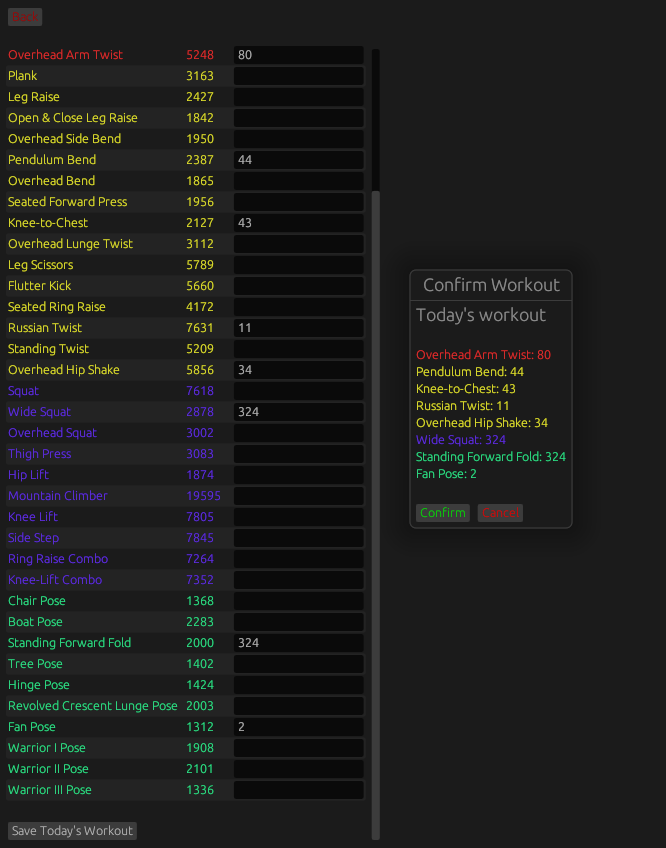
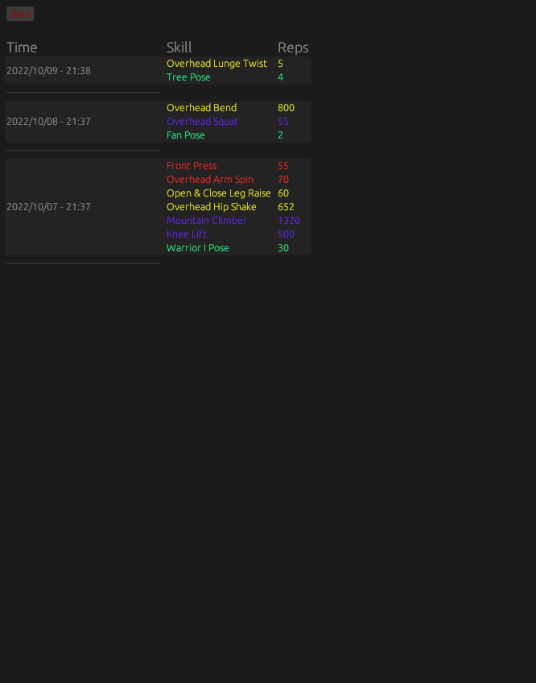
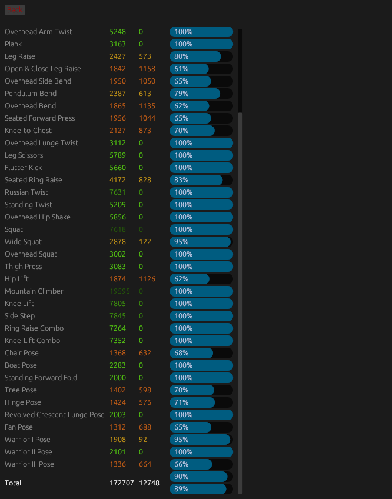
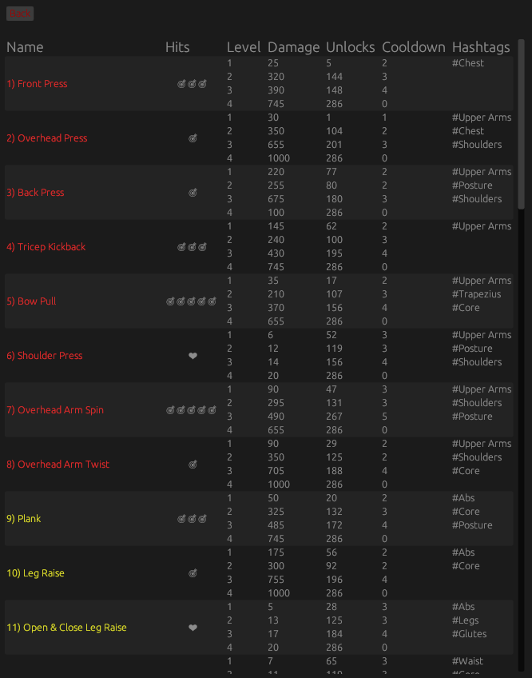

# Ring Fit Adventure Tracker

This is a small GUI project to help you track your Ring Fit Adventure workouts and 100% titles progess, built for fun and written in Rust.  

## Features

This project allows you to:

- Log and track your workouts
- See your progress for title completion
- Shows you skill informations

You can see more in the [Screenshots](#screenshots) section

Currently supported languages are:

- 🇬🇧 English
- 🇩🇪 German

More translations are always welcome! See [Contributing](#contributing) for more information.

## Downloads & Setup

On first time usage, two folders `./db/` and `./settings/` with files inside of them will be created. Your settings and progress are stored there so it is advised not to delete or move those.  
New files with default settings will be created if this does end up happening.

### Windows

If you are on Windows you can download the latest release on the [releases tab](https://github.com/atomflunder/ring-fit-adventure-tracker/releases) and run the executable `rfa.exe`.

Of course you can also [install rust](https://www.rust-lang.org/tools/install), clone this repository and run the program yourself using `cargo`:

```
cargo build --release   # To build
cargo run --release     # To run
```

### Linux & Mac OS

On Linux or Mac OS you will need to compile this program yourself.  
First you need to install Rust:

```
$ curl --proto '=https' --tlsv1.3 https://sh.rustup.rs -sSf | sh
```

Then clone this repository, and run the program yourself using `cargo`:

```
cargo build --release   # To build
cargo run --release     # To run
```

## Screenshots

| Log Workouts | Previous Workouts | Show Progress | Skill Information |
|---|---|---|---|
|||||

## Contributing

Contributions are always welcome!

Translations are especially needed.  
If you are able to contribute these, the strings that need to be translated can all be found inside the [`translations.json`](./assets/translations.json) file. You just need to create new entries for the ~90 strings in your chosen language, and you're good to go.

## License

This project is licensed under the [GNU General Public License, Version 2](./LICENSE).

## Links

- [Icons used](https://github.com/hmsk/ring-fit-adventure-icons)
- [egui](https://github.com/emilk/egui)
- [Ring Fit Adventure](https://www.nintendo.com/store/products/ring-fit-adventure-switch/)